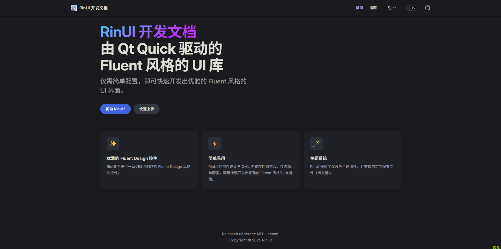

<div align="center">
<h1>RinUI Documentation</h1>
<p>The development documentation for RinUI, a Fluent Design-like Qt Quick (QML) UI library.</p>

**English**

</div>

> [!TIP]
> What is RinUI? Let's check [it](https://github.com/RinLit-233-shiroko/Rin-UI) out.

## 📄 Introduction

RinUI is a Fluent Design-like Qt Quick (QML) UI library. 

[Learn More >](https://github.com/RinLit-233-shiroko/Rin-UI)

### Online Preview

You can view the documentation online [here](https://ui.rinlit.cn/).

## 🪄 Quick Start
1. Install Dependencies
```bash
npm install
```
2. Start the Dev server
```bash
npm run docs:dev
```
3. Open the browser and go to `http://localhost:5173/`

## 🙌 Acknowledgements
### Resources
- [VitePress](https://github.com/vuejs/vitepress)

### Contributors
Contributions are welcome!
Thanks to the great people who contributed to this project.
[](https://github.com/RinLit-233-shiroko/RinUI-docs/graphs/contributors)

## 📜 License
This project is licensed under the MIT License, you can learn more about it in the [license file](./LICENSE).

Copyright © 2025 RinLit

##

This is an experimental project by Rin as a newcomer. Welcome to suggest and contribute to this project. ❤️
